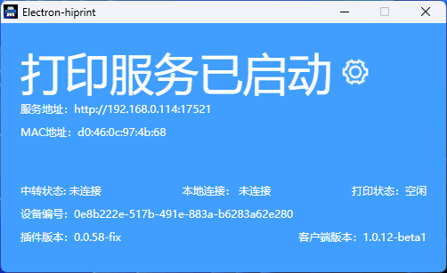
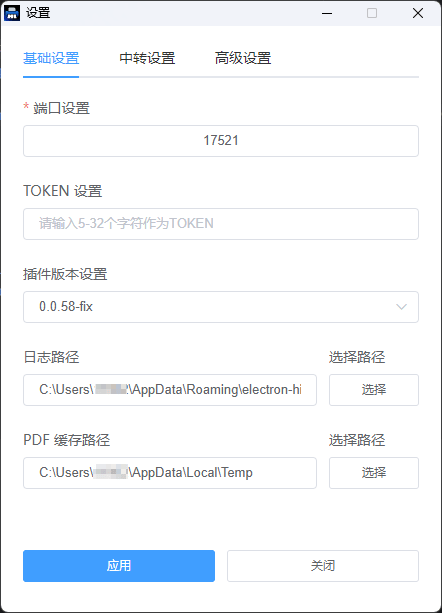

# electron-hiprint

这个项目是为 [vue-plugin-hiprint](https://github.com/CcSimple/vue-plugin-hiprint) 配套开发的不弹框静默打印方案，不过我们发现部分使用此项目的开发者有自己的设计器或渲染方案，也可能仅仅是需要将一段 HTML、一个 PDF 静默打印出来。如果你也是这样的需求，那么这个项目将能解决你的问题。

## 预览 <a href="https://ccsimple.gitee.io/vue-plugin-hiprint/">vue-plugin-hiprint</a> 打印设计 demo

<div align="center">



</div>

## 调试/打包

```console
git clone https://github.com/CcSimple/electron-hiprint.git
// or
git clone https://gitee.com/CcSimple/electron-hiprint.git
// init
cd electron-hiprint
npm i
// 调试预览
npm run start
// 打包 win x64
// 详情见package.json
npm run build-w-64
```

## Web 打印设计渲染插件

[vue-plugin-hiprint](https://github.com/CcSimple/vue-plugin-hiprint.git)

## 打印原理说明

1. 连接客户端开启的 socket.io 服务 (默认端口 17521)

   - socket.io-client^4.x 连接 ("http://localhost:17521")

2. 通过 socket.io-client^4.x 服务发送打印数据 (news)

   - socket.emit("news", { html, templateId, printer, pageSize });
   - 主要参数 html: 即 html 字符串，templateId: 用于回调 successs/error 时的标识
   - printer: 打印机名称，pageSize: 打印纸张大小 (其他参数,见下面的示例)

## 打印端设置

### v1.0.7 之后版本添加的设置功能

可在安装路径中修改 `config.json` 文件以修改设置，亦或者修改项目文件中默认值后重新打包自行发行自己的版本及设置。

也可以右键托盘，选择 `设置` 后在 `设置` 窗口中进行设置。

<div align="center">



</div>

```js
{
    "openAtLogin": true,                        // 登录时打开应用程序
    "openAsHidden": true,                       // 以隐藏方式打开应用程序
    "connectTransit": true,                     // 连接中转服务
    "port": "17521",                            // 端口号
    "token": null,                              // 身份验证 token
    "transitUrl": "https://printjs.cn:17521",   // 中转服务地址
    "transitToken": "vue-plugin-hiprint",       // 中转服务 token
    "closeType": "tray"                         // 主窗口关闭类型
}
```

1. `openAtLogin` Boolean 系统登录时自启动应用
2. `openAsHidden` Boolean 自启动时以隐藏方式打开应用
3. `connectTransit` Boolean 连接中转服务
4. `prot` String | Number ( 10000 - 65535 ) 端口号默认为 `17521`
5. `token` String( * | null ) 身份校验，只支持固定 token，需要登录等验证请自行二开实现
    - [vue-plugin-hiprint](https://github.com/CcSimple/vue-plugin-hiprint.git) 需要使用 [0.0.55](https://www.npmjs.com/package/vue-plugin-hiprint?activeTab=versions) 之后的版本
6. `transitUrl` 中转服务地址
7. `transitToken` 中转服务 token
8. `closeType` String( `tray` | `quit` ) 关闭主窗口后
    - 最小化到托盘 `tray`
    - 退出程序 `quit`

## 中转服务 [node-hiprint-transit](https://github.com/Xavier9896/node-hiprint-transit)

使用此客户端打印一直存在 http 跨域、web 只能连接本机客户端等问题，所以诞生了 `node-hiprint-transit` 这个中转代理服务。在 `V1.0.7` 版本中，添加了连接中转服务代理的设置，通过这些配置，将会在 `客户端` 与 `node-hiprint-transit` 间建立通信，在你的项目中，只需连接中转服务就能获取到所有连接中转服务的 `客户端` 信息，并且可以选择任意客户端的任意打印机进行打印。

如果你有云打印的需求，可以考虑使用此项目，将服务部署在服务器上，即可实现一个基础的云打印功能。

> 如果你的项目是一个 SaaS 类型的项目，你需要自行二开以实现不同租户之间的隔离。

# 非 `vue-plugin-hiprint` 插件连接使用本客户端说明

我们发现部分使用此项目的开发者并未使用 `vue-plugin-hiprint` 插件，他们有自己的设计器或渲染方案，所以特此将本项目的使用说明进行了补充，方便广大开发者使用。

## 连接客户端

1. 在你自己的项目中引入 socket.io-client^4.x 依赖

    ```console
    npm i socket.io-client --save
    ```

2. 连接客户端

    ```js
    import { io } from "socket.io-client";

    const socket = io("http://localhost:17521", {
      transports: ["websocket"],
      auth: {
        token: "vue-plugin-hiprint", // 在此处填入你 client 设置的 token，缺省可留空
      }
    })
    ```

## 获取客户端信息

```js
socket.on("connect", () => {
  globalThis.connect = true;
  // TODO: Do something for your project
})
```

### 连接为 `electron-hiprint`

连接成功后 `electron-hiprint` 会主动发送 `clientInfo`、`printerList` 事件，你只需要监听这两个事件即可获取到客户端信息与打印机列表。

```js
socket.on("clientInfo", (clientInfo) => {
  globalThis.clientInfo = clientInfo;
});

socket.on("printerList", (printerList) => {
  globalThis.printerList = printerList;
})
```

```js
// clientInfo
{
  arch: "x64",
  clientUrl: "http://192.168.0.2:17521",
  ip: "192.168.0.2",
  ipv6: "fe80::13f:eb0f:e426:7c92",
  mac: "a1:a2:a3:a4:a5:a6",
  machineId: "12c90ff9-b9f4-4178-9099-9dd326b70c2e",
  platform: "win32",
  version: "1.0.7",
}

// printerList
[{
  description: "",
  displayName: "Microsoft Print to PDF",
  isDefault: true,
  name: "Microsoft Print to PDF",
  options: {,
    "printer-location": "",
    "printer-make-and-model": "Microsoft Print To PDF",
    "system_driverinfo": "Microsoft Print To PDF;10.0.19041.3570 (WinBuild.160101.0800);Microsoft® Windows® Operating System;10.0.19041.3570"
  },
  status: 0
}, {…}, {…}, {…}, {…}, {…}]
```

你也可以主动向 `electron-hiprint` 发送 `getClientInfo`、`refreshPrinterList` 事件，来获取客户端打印机列表。

```js
socket.emit("getClientInfo");
socket.emit("refreshPrinterList");
```

### 连接为 `node-hiprint-transit`

连接成功后 `node-hiprint-transit` 会主动发送 `clients`、`printerList` 事件，你只需要监听这两个事件即可获取到客户端信息与打印机列表。

```js
socket.on("clients", (clients) => {
  globalThis.clients = clients;
});

socket.on("printerList", (printerList) => {
  globalThis.printerList = printerList;
})
```

```js
// clients
{
  "AlBaUCNs3AIMFPLZAAAh": {
    arch: "x64",
    clientUrl: "http://192.168.0.2:17521",
    ip: "192.168.0.2",
    ipv6: "fe80::13f:eb0f:e426:7c92",
    mac: "a1:a2:a3:a4:a5:a6",
    machineId: "12c90ff9-b9f4-4178-9099-9dd326b70c2e",
    platform: "win32",
    printerList: [{
      description: "",
      displayName: "Microsoft Print to PDF",
      isDefault: true,
      name: "Microsoft Print to PDF",
      options: {,
        "printer-location": "",
        "printer-make-and-model": "Microsoft Print To PDF",
        "system_driverinfo": "Microsoft Print To PDF;10.0.19041.3570 (WinBuild.160101.0800);Microsoft® Windows® Operating System;10.0.19041.3570"
      },
      status: 0
    }, {…}, {…}, {…}, {…}, {…}],
    version: "1.0.7",
  },
  "clientid": {…},
  ...
}

// printerList
[{
  clientId: "AlBaUCNs3AIMFPLZAAAh",
  description: "",
  displayName: "Microsoft Print to PDF",
  isDefault: true,
  name: "Microsoft Print to PDF",
  options: {,
    "printer-location": "",
    "printer-make-and-model": "Microsoft Print To PDF",
    "system_driverinfo": "Microsoft Print To PDF;10.0.19041.3570 (WinBuild.160101.0800);Microsoft® Windows® Operating System;10.0.19041.3570"
  },
  status: 0
}, {…}, {…}, {…}, {…}, {…}]
```

你也可以主动向 `electron-hiprint` 发送 `getClients`、`refreshPrinterList` 事件，来获取客户端打印机列表。

```js
socket.emit("getClients");

socket.emit("refreshPrinterList");
// node-hiprint-transit 会将这个请求再转发给所有连接的 electron-hiprint ，以获取最新的打印机列表，但是并没有等待所有 electron-hiprint 响应结束，而是在延迟 2s 后直接返回了缓存及新获取到的打印机列表。并且 node-hiprint-transit 每 10min 都会主动向 electron-hiprint 请求一次 printerList，所以这应该并无大碍。或者你也可以优化这一个功能。

// https://github.com/Xavier9896/node-hiprint-transit/blob/main/index.js#L139
```

## 打印 HTML

### 连接为 `electron-hiprint`

```js
/**
 * @description: 打印 html 字符串
 * @param {String} html 打印的html字符串
 * @param {String|number} templateId vue-plugin-hiprint 中的模板id，你可以自定义传入一个 Id，用于回调 success/error 判断
 * @param {String} printer 打印机名称 printer.name 可为空，缺省默认使用设备默认打印机
 * @param {pageSize} pageSize 打印纸张大小 { height: 80 * 1000, width: 60 * 1000 } 可为空，缺省默认使用打印机默认纸张
 * @description: 其他参数参考 默认打印参数说明
 */
if (globalThis.connect) {
  socket.emit("news", { html, templateId, printer, pageSize });
} else {
  alert("未连接客户端！")
  window.open("hiprint://")
}
```

### 连接为 `node-hiprint-transit`

当你连接中转服务时，需要在参数中指定 `client`

```js
// 你可以自行在项目中实现一个选择客户端、打印机的功能
const clientId = "AlBaUCNs3AIMFPLZAAAh"
const client = globalThis.clients[clientId]
const printer = globalThis.clients[0].printerList[0]

if (globalThis.connect) {
  socket.emit("news", { html, client: clientId, templateId, printer, pageSize })
  socket.emit("news", { html, client: client.clientId, templateId, printer: printer.name, pageSize })
} else {
  alert("未连接客户端！")
  window.open("hiprint://")
}
```

### 默认打印参数说明

```js
// 详见electron文档: https://www.electronjs.org/zh/docs/latest/api/web-contents
{
    silent: data.silent ?? true, // 静默打印
    printBackground: data.printBackground ?? true, // 是否打印背景
    deviceName: deviceName, // 打印机名称
    color: data.color ?? true, // 是否打印颜色
    margins: data.margins ?? {
      marginType: "none",
    }, // 边距
    landscape: data.landscape ?? false, // 是否横向打印
    scaleFactor: data.scaleFactor ?? 100, // 打印缩放比例
    pagesPerSheet: data.pagesPerSheet ?? 1, // 每张纸的页数
    collate: data.collate ?? true, // 是否排序
    copies: data.copies ?? 1, // 打印份数
    pageRanges: data.pageRanges ?? {}, // 打印页数
    duplexMode: data.duplexMode, // 打印模式 simplex,shortEdge,longEdge
    dpi: data.dpi, // 打印机DPI
    header: data.header, // 打印头
    footer: data.footer, // 打印尾
    pageSize: data.pageSize, // 打印纸张 // A0, A1, A2, A3, A4, A5, A6, Legal, Letter, Tabloid
}
// 其中纸张大小参数 pageSize 如果传自定义大小, 需要乘以 1000
{ height: 80 * 1000, width: 60 * 1000 }
```

## 使用 pdf 打印功能

原理:

1. 通过 electron 的 printToPDF 先导出 pdf 文件
2. 再通过 pdf-to-printer 或 unix-print 打印 pdf 文件

> 传数据时需要传入: { type:'pdf' }

> 如果是自定义的纸张大小, 别忘了 传 自定义的 pageSize

eg: {height: 80 * 1000, width: 60 * 1000}

```js
{
    client?: string; // 客户端id，连接中转服务必填
    printer?: string; // 打印机名称
    pages?: string; // 打印页数
    subset?: string; // 奇偶页 even、odd
    orientation?: string; // 纸张方向 portrait、landscape
    scale?: string; // 缩放 noscale、shrink、fit
    monochrome?: boolean; // 黑白打印 true、false
    side?: string; // 单双面 duplex, duplexshort, duplexlong, and simplex
    bin?: string; // select tray to print to
    paperName?: string; // 纸张大小 A2, A3, A4, A5, A6, letter, legal, tabloid, statement
    silent?: boolean; // Silences error messages.
    printDialog?: boolean; // 显示打印对话框 true、false
    copies?: number; // 打印份数
}

// vue-plugin-hiprint
hiprint.hiwebSocket.send({ html, client, printer, type: 'pdf'})

// 非vue-plugin-hiprint
socket.emit("news", { html, client, printer, type: 'pdf'})
```
## 下载网络 pdf 打印

原理：

1.通过node的http或https库下载网络pdf文件至用户临时目录
2.后续内容同使用pdf打印功能

> 因为打印网络pdf不存在模板拼接，所以打印时直接如下调用即可

```js
// vue-plugin-hiprint
hiprint.hiwebSocket.send({ client, printer, type: 'url_pdf', pdf_path: '网络PDF的下载url' })

// 非vue-plugin-hiprint
socket.emit("news", { client, printer, type: 'url_pdf', pdf_path: '网络PDF的下载url' })
```

## 打印回调

```js
socket.on("success", (res) => {
  console.log(res.templateId)
  // TODO: Do something for your project
})

socket.on("error", (res) => {
  console.log(res.templateId)
  // TODO: Do something for your project
})
```

## URLScheme `hiprint://`

通过 URLScheme 可以方便的让我们在 Web 项目中调起当前设备中安装的 `electron-hiprint` 客户端，以便未建立连接时主动唤起客户端。

> 安装客户端时请 `以管理员身份运行` ，才能成功添加 URLScheme

使用：浏览器地址栏输入 `hiprint://` 并回车

<div align="center">


</div>

```js
// js
window.open("hiprint://")

// element-ui
this.$alert(`连接【${hiwebSocket.host}】失败！<br>请确保目标服务器已<a href="https://gitee.com/CcSimple/electron-hiprint/releases" target="_blank"> 下载 </a> 并 <a href="hiprint://" target="_blank"> 运行 </a> 打印服务！`, "客户端未连接", {dangerouslyUseHtmlString: true})

// ant-design v1
this.$error({
  title: "客户端未连接",
  content: (h) => (
    <div>
      连接【{hiwebSocket.host}】失败！
      <br />
      请确保目标服务器已
      <a
        href="https://gitee.com/CcSimple/electron-hiprint/releases"
        target="_blank"
      >
        下载
      </a>
      并
      <a href="hiprint://" target="_blank">
        运行
      </a>
      打印服务！
    </div>
  ),
});
```

## 学习借鉴

- electron <a href="https://www.electronjs.org/zh/docs/latest/">https://www.electronjs.org/zh/docs/latest/</a>
- electron-egg <a href="https://gitee.com/wallace5303/electron-egg/">https://gitee.com/wallace5303/electron-egg/</a>
- pdf-to-printer <a href="https://github.com/artiebits/pdf-to-printer">https://github.com/artiebits/pdf-to-printer</a>
- unix-printer <a href="https://github.com/artiebits/unix-print">https://github.com/artiebits/unix-print</a>
